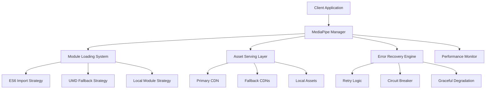

# MediaPipe Face Landmarker v2 Solution Architecture

## Executive Summary

This document presents a robust solution architecture for MediaPipe Face Landmarker v2 integration that addresses common loading issues, provides comprehensive fallback mechanisms, and ensures reliable performance across development and production environments. The architecture employs multi-layered loading strategies, error recovery patterns, and performance optimization techniques.

## 1. Architecture Overview

### 1.1 System Components



### 1.2 Core Principles

- **Resilience**: Multiple fallback mechanisms prevent single points of failure
- **Performance**: Optimized loading patterns and caching strategies
- **Compatibility**: Cross-browser and cross-platform support
- **Observability**: Comprehensive monitoring and diagnostics
- **Scalability**: Efficient resource utilization and memory management

## 2. Module Loading Strategy

### 2.1 Multi-Tier Loading Architecture

#### Tier 1: ES6 Dynamic Import (Primary)
```javascript
// Modern browsers with ES6 module support
const loadStrategy1 = async () => {
    try {
        const { FilesetResolver, FaceLandmarker } = await import(
            "https://cdn.jsdelivr.net/npm/@mediapipe/tasks-vision@0.10.22/vision_bundle.mjs"
        );
        return { FilesetResolver, FaceLandmarker, method: 'ES6_IMPORT' };
    } catch (error) {
        throw new ModuleLoadError('ES6_IMPORT_FAILED', error);
    }
};
```

#### Tier 2: UMD Bundle Loading (Fallback)
```javascript
// Legacy browser support via UMD bundles
const loadStrategy2 = async () => {
    await loadScript("https://cdn.jsdelivr.net/npm/@mediapipe/tasks-vision@0.10.22/vision_bundle.js");
    
    if (window.MediaPipeVision) {
        return {
            FilesetResolver: window.MediaPipeVision.FilesetResolver,
            FaceLandmarker: window.MediaPipeVision.FaceLandmarker,
            method: 'UMD_GLOBAL'
        };
    }
    
    throw new ModuleLoadError('UMD_LOAD_FAILED', 'Global exports not found');
};
```

#### Tier 3: Local Module Loading (Emergency)
```javascript
// Local fallback for offline or restricted environments
const loadStrategy3 = async () => {
    try {
        const { FilesetResolver, FaceLandmarker } = await import('./local/mediapipe-bundle.mjs');
        return { FilesetResolver, FaceLandmarker, method: 'LOCAL_IMPORT' };
    } catch (error) {
        throw new ModuleLoadError('LOCAL_IMPORT_FAILED', error);
    }
};
```

### 2.2 Module Loading Controller

```javascript
class ModuleLoadingController {
    constructor() {
        this.strategies = [
            { name: 'ES6_IMPORT', loader: this.loadES6Modules, priority: 1 },
            { name: 'UMD_BUNDLE', loader: this.loadUMDBundle, priority: 2 },
            { name: 'LOCAL_MODULE', loader: this.loadLocalModule, priority: 3 }
        ];
        this.cache = new Map();
        this.failureHistory = new Map();
    }
    
    async loadMediaPipeModules() {
        // Sort strategies by success history and priority
        const sortedStrategies = this.strategies
            .filter(s => !this.isRecentlyFailed(s.name))
            .sort((a, b) => {
                const aFailures = this.failureHistory.get(a.name) || 0;
                const bFailures = this.failureHistory.get(b.name) || 0;
                return (aFailures - bFailures) || (a.priority - b.priority);
            });
        
        for (const strategy of sortedStrategies) {
            try {
                const result = await this.executeWithTimeout(
                    strategy.loader.bind(this),
                    15000,
                    `${strategy.name}_TIMEOUT`
                );
                
                this.cache.set('modules', result);
                this.resetFailureCount(strategy.name);
                return result;
                
            } catch (error) {
                this.recordFailure(strategy.name, error);
                console.warn(`Strategy ${strategy.name} failed:`, error.message);
            }
        }
        
        throw new ModuleLoadError('ALL_STRATEGIES_FAILED', 'No module loading strategy succeeded');
    }
}
```

## 3. Asset Serving Configuration

### 3.1 CDN Hierarchy

```javascript
const CDN_CONFIGURATION = {
    primary: {
        name: 'jsDelivr',
        baseUrl: 'https://cdn.jsdelivr.net/npm/@mediapipe/tasks-vision',
        versions: ['0.10.22', '0.10.21', '0.10.20'],
        reliability: 0.95,
        avgLatency: 150
    },
    fallbacks: [
        {
            name: 'Unpkg',
            baseUrl: 'https://unpkg.com/@mediapipe/tasks-vision',
            reliability: 0.90,
            avgLatency: 200
        },
        {
            name: 'Skypack',
            baseUrl: 'https://cdn.skypack.dev/@mediapipe/tasks-vision',
            reliability: 0.85,
            avgLatency: 300
        },
        {
            name: 'ESM.sh',
            baseUrl: 'https://esm.sh/@mediapipe/tasks-vision',
            reliability: 0.88,
            avgLatency: 250
        }
    ],
    local: {
        name: 'Local Assets',
        baseUrl: './assets/mediapipe',
        reliability: 1.0,
        avgLatency: 10
    }
};
```

### 3.2 Asset Server Configuration

#### Development Environment
```nginx
# Development nginx configuration
server {
    listen 3000;
    server_name localhost;
    
    # Enable CORS for development
    location / {
        add_header 'Access-Control-Allow-Origin' '*';
        add_header 'Access-Control-Allow-Methods' 'GET, POST, OPTIONS';
        add_header 'Access-Control-Allow-Headers' 'Content-Type, Authorization';
    }
    
    # Serve WASM files with correct MIME type
    location ~* \.wasm$ {
        add_header 'Content-Type' 'application/wasm';
        add_header 'Cache-Control' 'public, max-age=31536000';
        gzip_static on;
    }
    
    # MediaPipe assets caching
    location /assets/mediapipe/ {
        expires 1y;
        add_header Cache-Control "public, immutable";
    }
}
```

#### Production Environment
```nginx
# Production nginx configuration with security headers
server {
    listen 443 ssl http2;
    server_name your-domain.com;
    
    # Security headers
    add_header X-Frame-Options DENY;
    add_header X-Content-Type-Options nosniff;
    add_header Referrer-Policy strict-origin-when-cross-origin;
    
    # Content Security Policy for MediaPipe
    add_header Content-Security-Policy "
        default-src 'self';
        script-src 'self' 'unsafe-eval' https://cdn.jsdelivr.net https://unpkg.com;
        worker-src 'self' blob:;
        connect-src 'self' https://cdn.jsdelivr.net https://unpkg.com https://storage.googleapis.com;
        img-src 'self' data: blob:;
    ";
    
    # WASM optimization
    location ~* \.wasm$ {
        add_header 'Content-Type' 'application/wasm';
        add_header 'Cross-Origin-Embedder-Policy' 'require-corp';
        add_header 'Cross-Origin-Opener-Policy' 'same-origin';
        expires 1y;
        gzip_static on;
        brotli_static on;
    }
    
    # Preload critical MediaPipe resources
    location = / {
        add_header 'Link' '</assets/mediapipe/vision_wasm_internal.wasm>; rel=preload; as=fetch; crossorigin';
    }
}
```

### 3.3 Asset Preloading Strategy

```javascript
class AssetPreloader {
    constructor() {
        this.preloadQueue = [];
        this.preloadStatus = new Map();
    }
    
    async preloadCriticalAssets() {
        const criticalAssets = [
            {
                url: 'https://cdn.jsdelivr.net/npm/@mediapipe/tasks-vision@0.10.22/wasm/vision_wasm_internal.wasm',
                type: 'fetch',
                priority: 'high'
            },
            {
                url: 'https://storage.googleapis.com/mediapipe-models/face_landmarker/face_landmarker/float16/1/face_landmarker.task',
                type: 'fetch',
                priority: 'high'
            }
        ];
        
        const preloadPromises = criticalAssets.map(asset => 
            this.preloadAsset(asset).catch(error => {
                console.warn(`Preload failed for ${asset.url}:`, error.message);
                return null;
            })
        );
        
        const results = await Promise.allSettled(preloadPromises);
        const successfulPreloads = results.filter(r => r.status === 'fulfilled' && r.value).length;
        
        console.log(`Preloaded ${successfulPreloads}/${criticalAssets.length} critical assets`);
        return successfulPreloads > 0;
    }
    
    async preloadAsset(asset) {
        if (this.preloadStatus.has(asset.url)) {
            return this.preloadStatus.get(asset.url);
        }
        
        const preloadPromise = this.createPreloadLink(asset);
        this.preloadStatus.set(asset.url, preloadPromise);
        
        return preloadPromise;
    }
    
    createPreloadLink(asset) {
        return new Promise((resolve, reject) => {
            const link = document.createElement('link');
            link.rel = 'prefetch';
            link.href = asset.url;
            link.as = asset.type;
            
            if (asset.type === 'fetch') {
                link.crossOrigin = 'anonymous';
            }
            
            link.onload = () => resolve(asset);
            link.onerror = () => reject(new Error(`Preload failed: ${asset.url}`));
            
            document.head.appendChild(link);
            
            // Cleanup timeout
            setTimeout(() => {
                if (document.head.contains(link)) {
                    document.head.removeChild(link);
                }
            }, 30000);
        });
    }
}
```

## 4. Fallback Mechanisms

### 4.1 Cascading Fallback Strategy

```javascript
class FallbackController {
    constructor() {
        this.fallbackChain = [
            { name: 'PRIMARY_CDN', handler: this.tryPrimaryCDN },
            { name: 'SECONDARY_CDN', handler: this.trySecondaryCDN },
            { name: 'LOCAL_ASSETS', handler: this.tryLocalAssets },
            { name: 'CPU_ONLY_MODE', handler: this.tryCPUOnlyMode },
            { name: 'MINIMAL_MODE', handler: this.tryMinimalMode }
        ];
        
        this.fallbackMetrics = new Map();
    }
    
    async executeWithFallback(operation, context = {}) {
        let lastError = null;
        
        for (const fallback of this.fallbackChain) {
            try {
                console.log(`Attempting fallback: ${fallback.name}`);
                
                const result = await this.executeWithTimeout(
                    () => fallback.handler.call(this, operation, context),
                    context.timeout || 15000
                );
                
                this.recordFallbackSuccess(fallback.name);
                return result;
                
            } catch (error) {
                lastError = error;
                this.recordFallbackFailure(fallback.name, error);
                
                if (this.isUnrecoverableError(error)) {
                    break;
                }
                
                await this.exponentialBackoff(fallback.name);
            }
        }
        
        throw new FallbackExhaustedError('All fallback strategies failed', lastError);
    }
    
    isUnrecoverableError(error) {
        const unrecoverableTypes = [
            'QUOTA_EXCEEDED',
            'SECURITY_ERROR',
            'WEBGL_CONTEXT_LOST',
            'INSUFFICIENT_MEMORY'
        ];
        
        return unrecoverableTypes.some(type => 
            error.message.includes(type) || error.name === type
        );
    }
    
    async exponentialBackoff(strategyName) {
        const failures = this.fallbackMetrics.get(strategyName)?.failures || 0;
        const baseDelay = 1000;
        const maxDelay = 10000;
        const delay = Math.min(baseDelay * Math.pow(2, failures), maxDelay);
        
        console.log(`Backing off for ${delay}ms after ${strategyName} failure`);
        await new Promise(resolve => setTimeout(resolve, delay));
    }
}
```

### 4.2 Circuit Breaker Pattern

```javascript
class CircuitBreaker {
    constructor(options = {}) {
        this.failureThreshold = options.failureThreshold || 5;
        this.resetTimeout = options.resetTimeout || 60000;
        this.monitoringPeriod = options.monitoringPeriod || 300000;
        
        this.state = 'CLOSED'; // CLOSED, OPEN, HALF_OPEN
        this.failureCount = 0;
        this.lastFailureTime = null;
        this.nextAttempt = null;
        this.successCount = 0;
    }
    
    async execute(operation, fallbackOperation = null) {
        if (this.state === 'OPEN') {
            if (Date.now() < this.nextAttempt) {
                return this.executeFallback(fallbackOperation);
            } else {
                this.state = 'HALF_OPEN';
                this.successCount = 0;
            }
        }
        
        try {
            const result = await operation();
            this.onSuccess();
            return result;
        } catch (error) {
            this.onFailure();
            
            if (this.state === 'OPEN') {
                return this.executeFallback(fallbackOperation);
            }
            
            throw error;
        }
    }
    
    onSuccess() {
        this.failureCount = 0;
        this.successCount++;
        
        if (this.state === 'HALF_OPEN' && this.successCount >= 2) {
            this.state = 'CLOSED';
            console.log('Circuit breaker reset to CLOSED state');
        }
    }
    
    onFailure() {
        this.failureCount++;
        this.lastFailureTime = Date.now();
        
        if (this.failureCount >= this.failureThreshold) {
            this.state = 'OPEN';
            this.nextAttempt = Date.now() + this.resetTimeout;
            console.log(`Circuit breaker OPENED after ${this.failureCount} failures`);
        }
    }
    
    async executeFallback(fallbackOperation) {
        if (fallbackOperation) {
            try {
                return await fallbackOperation();
            } catch (fallbackError) {
                throw new Error(`Primary operation failed and fallback also failed: ${fallbackError.message}`);
            }
        }
        
        throw new Error('Operation failed and no fallback provided');
    }
}
```

## 5. Error Recovery Patterns

### 5.1 Error Classification System

```javascript
class ErrorClassifier {
    static ERROR_TYPES = {
        NETWORK: {
            patterns: ['NetworkError', 'fetch failed', 'CORS', 'ERR_NETWORK'],
            recoverable: true,
            strategy: 'RETRY_WITH_FALLBACK'
        },
        MODULE_LOAD: {
            patterns: ['Cannot read property', 'import failed', 'SyntaxError'],
            recoverable: true,
            strategy: 'ALTERNATIVE_LOADING'
        },
        WEBGL: {
            patterns: ['WebGL', 'context lost', 'GPU process crashed'],
            recoverable: true,
            strategy: 'CPU_FALLBACK'
        },
        MEMORY: {
            patterns: ['out of memory', 'allocation failed', 'QUOTA_EXCEEDED'],
            recoverable: false,
            strategy: 'GRACEFUL_DEGRADATION'
        },
        SECURITY: {
            patterns: ['SecurityError', 'CORS policy', 'CSP violation'],
            recoverable: false,
            strategy: 'LOCAL_FALLBACK'
        }
    };
    
    static classify(error) {
        const errorMessage = error.message || error.toString();
        
        for (const [type, config] of Object.entries(this.ERROR_TYPES)) {
            const isMatch = config.patterns.some(pattern => 
                errorMessage.includes(pattern) || error.name === pattern
            );
            
            if (isMatch) {
                return {
                    type,
                    recoverable: config.recoverable,
                    strategy: config.strategy,
                    originalError: error
                };
            }
        }
        
        return {
            type: 'UNKNOWN',
            recoverable: true,
            strategy: 'BASIC_RETRY',
            originalError: error
        };
    }
}
```

### 5.2 Recovery Strategy Executor

```javascript
class RecoveryExecutor {
    constructor() {
        this.strategies = {
            'RETRY_WITH_FALLBACK': this.retryWithFallback,
            'ALTERNATIVE_LOADING': this.tryAlternativeLoading,
            'CPU_FALLBACK': this.switchToCPUMode,
            'GRACEFUL_DEGRADATION': this.enableGracefulDegradation,
            'LOCAL_FALLBACK': this.useLocalAssets,
            'BASIC_RETRY': this.basicRetry
        };
        
        this.recoveryHistory = [];
        this.maxRecoveryAttempts = 3;
    }
    
    async executeRecovery(classifiedError, operation, context = {}) {
        const strategy = this.strategies[classifiedError.strategy];
        
        if (!strategy) {
            throw new Error(`Unknown recovery strategy: ${classifiedError.strategy}`);
        }
        
        this.recordRecoveryAttempt(classifiedError);
        
        try {
            const result = await strategy.call(this, operation, classifiedError, context);
            this.recordRecoverySuccess(classifiedError);
            return result;
        } catch (recoveryError) {
            this.recordRecoveryFailure(classifiedError, recoveryError);
            throw recoveryError;
        }
    }
    
    async retryWithFallback(operation, classifiedError, context) {
        const fallbackUrls = context.fallbackUrls || [];
        let lastError = classifiedError.originalError;
        
        for (const url of fallbackUrls) {
            try {
                await new Promise(resolve => setTimeout(resolve, 1000));
                return await operation({ ...context, url });
            } catch (error) {
                lastError = error;
                console.warn(`Fallback URL failed: ${url}`, error.message);
            }
        }
        
        throw lastError;
    }
    
    async tryAlternativeLoading(operation, classifiedError, context) {
        const loadingMethods = ['ES6_IMPORT', 'UMD_BUNDLE', 'LOCAL_MODULE'];
        const currentMethod = context.currentMethod;
        const alternatives = loadingMethods.filter(m => m !== currentMethod);
        
        for (const method of alternatives) {
            try {
                return await operation({ ...context, loadingMethod: method });
            } catch (error) {
                console.warn(`Alternative loading method failed: ${method}`, error.message);
            }
        }
        
        throw new Error('All alternative loading methods failed');
    }
    
    async switchToCPUMode(operation, classifiedError, context) {
        console.log('Switching to CPU-only mode due to WebGL issues');
        
        return await operation({
            ...context,
            forceCPU: true,
            delegate: 'CPU',
            webglDisabled: true
        });
    }
}
```

## 6. Performance Optimization Strategies

### 6.1 Loading Performance Optimization

```javascript
class PerformanceOptimizer {
    constructor() {
        this.metrics = {
            initializationTimes: [],
            analysisTimes: [],
            memoryUsage: [],
            errorRates: new Map()
        };
        
        this.optimizations = {
            enablePreloading: true,
            enableCaching: true,
            enableCompression: true,
            enableBundleSplitting: true
        };
    }
    
    async optimizeInitialization(initFunction) {
        const startTime = performance.now();
        let result;
        
        try {
            // Preload critical resources
            if (this.optimizations.enablePreloading) {
                await this.preloadCriticalResources();
            }
            
            // Use cached modules if available
            if (this.optimizations.enableCaching && this.hasCachedModules()) {
                result = await this.initializeFromCache();
            } else {
                result = await initFunction();
                if (this.optimizations.enableCaching) {
                    await this.cacheModules(result);
                }
            }
            
            const initTime = performance.now() - startTime;
            this.recordMetric('initializationTimes', initTime);
            
            console.log(`Initialization completed in ${initTime.toFixed(2)}ms`);
            return result;
            
        } catch (error) {
            const initTime = performance.now() - startTime;
            this.recordError('initialization', error, initTime);
            throw error;
        }
    }
    
    async preloadCriticalResources() {
        const resources = [
            'https://cdn.jsdelivr.net/npm/@mediapipe/tasks-vision@0.10.22/wasm/vision_wasm_internal.wasm',
            'https://storage.googleapis.com/mediapipe-models/face_landmarker/face_landmarker/float16/1/face_landmarker.task'
        ];
        
        const preloadPromises = resources.map(url => 
            this.preloadResource(url).catch(error => {
                console.warn(`Preload failed for ${url}:`, error.message);
                return null;
            })
        );
        
        const results = await Promise.allSettled(preloadPromises);
        const successful = results.filter(r => r.status === 'fulfilled').length;
        
        console.log(`Preloaded ${successful}/${resources.length} resources`);
        return successful > 0;
    }
    
    async preloadResource(url) {
        // Use different preloading strategies based on browser support
        if ('serviceWorker' in navigator && navigator.serviceWorker.controller) {
            return this.preloadViaServiceWorker(url);
        } else if (window.fetch) {
            return this.preloadViaFetch(url);
        } else {
            return this.preloadViaLink(url);
        }
    }
    
    async preloadViaFetch(url) {
        const response = await fetch(url, { 
            mode: 'cors',
            cache: 'force-cache'
        });
        
        if (!response.ok) {
            throw new Error(`Preload failed: ${response.status} ${response.statusText}`);
        }
        
        return response;
    }
}
```

### 6.2 Runtime Performance Monitoring

```javascript
class RuntimeMonitor {
    constructor() {
        this.performanceObserver = null;
        this.memoryMonitor = null;
        this.isMonitoring = false;
        this.metrics = {
            frameRates: [],
            memoryUsage: [],
            analysisLatency: [],
            errorFrequency: new Map()
        };
    }
    
    startMonitoring() {
        if (this.isMonitoring) return;
        
        this.isMonitoring = true;
        
        // Monitor performance metrics
        if ('PerformanceObserver' in window) {
            this.performanceObserver = new PerformanceObserver((list) => {
                for (const entry of list.getEntries()) {
                    this.processPerformanceEntry(entry);
                }
            });
            
            this.performanceObserver.observe({ 
                entryTypes: ['measure', 'navigation', 'resource'] 
            });
        }
        
        // Monitor memory usage
        if (window.performance && window.performance.memory) {
            this.memoryMonitor = setInterval(() => {
                const memory = window.performance.memory;
                this.metrics.memoryUsage.push({
                    timestamp: Date.now(),
                    used: memory.usedJSHeapSize,
                    total: memory.totalJSHeapSize,
                    limit: memory.jsHeapSizeLimit
                });
                
                // Keep only last 100 measurements
                if (this.metrics.memoryUsage.length > 100) {
                    this.metrics.memoryUsage.shift();
                }
                
                this.checkMemoryLeaks();
            }, 5000);
        }
        
        // Monitor frame rate
        this.startFrameRateMonitoring();
    }
    
    startFrameRateMonitoring() {
        let lastTime = performance.now();
        let frameCount = 0;
        
        const measureFrameRate = (currentTime) => {
            frameCount++;
            
            if (currentTime - lastTime >= 1000) {
                const fps = frameCount * 1000 / (currentTime - lastTime);
                this.metrics.frameRates.push({
                    timestamp: Date.now(),
                    fps: fps
                });
                
                // Keep only last 60 measurements (1 minute at 1 FPS)
                if (this.metrics.frameRates.length > 60) {
                    this.metrics.frameRates.shift();
                }
                
                frameCount = 0;
                lastTime = currentTime;
            }
            
            if (this.isMonitoring) {
                requestAnimationFrame(measureFrameRate);
            }
        };
        
        requestAnimationFrame(measureFrameRate);
    }
    
    checkMemoryLeaks() {
        if (this.metrics.memoryUsage.length < 10) return;
        
        const recent = this.metrics.memoryUsage.slice(-10);
        const oldest = recent[0];
        const newest = recent[recent.length - 1];
        
        const growthRate = (newest.used - oldest.used) / oldest.used;
        const timeSpan = newest.timestamp - oldest.timestamp;
        
        if (growthRate > 0.1 && timeSpan > 30000) { // 10% growth over 30 seconds
            console.warn('Potential memory leak detected:', {
                growthRate: (growthRate * 100).toFixed(2) + '%',
                timeSpan: timeSpan / 1000 + 's',
                currentUsage: (newest.used / 1024 / 1024).toFixed(2) + 'MB'
            });
            
            this.triggerMemoryCleanup();
        }
    }
    
    getPerformanceReport() {
        return {
            averageFrameRate: this.calculateAverageFrameRate(),
            memoryTrend: this.analyzeMemoryTrend(),
            analysisPerformance: this.getAnalysisPerformanceStats(),
            recommendations: this.generatePerformanceRecommendations()
        };
    }
}
```

## 7. Browser Compatibility Matrix

### 7.1 Support Matrix

| Browser | Version | ES6 Modules | WebAssembly | WebGL 2.0 | Support Level | Notes |
|---------|---------|-------------|-------------|-----------|---------------|-------|
| Chrome | 91+ | ✅ | ✅ | ✅ | Full | Recommended |
| Chrome | 80-90 | ✅ | ✅ | ✅ | Full | Stable |
| Chrome | 70-79 | ⚠️ | ✅ | ✅ | Partial | Use UMD fallback |
| Firefox | 89+ | ✅ | ✅ | ✅ | Full | Recommended |
| Firefox | 78-88 | ✅ | ✅ | ✅ | Full | Stable |
| Firefox | 60-77 | ⚠️ | ✅ | ⚠️ | Limited | CPU fallback |
| Safari | 15+ | ✅ | ✅ | ✅ | Full | iOS 15+ |
| Safari | 14+ | ✅ | ✅ | ⚠️ | Partial | Limited WebGL |
| Safari | 13+ | ⚠️ | ✅ | ❌ | Limited | CPU only |
| Edge | 91+ | ✅ | ✅ | ✅ | Full | Chromium-based |
| Edge Legacy | Any | ❌ | ⚠️ | ⚠️ | Unsupported | Use polyfills |

### 7.2 Compatibility Detection

```javascript
class CompatibilityDetector {
    static detect() {
        return {
            browser: this.detectBrowser(),
            features: this.detectFeatures(),
            limitations: this.detectLimitations(),
            recommendedConfig: this.getRecommendedConfig()
        };
    }
    
    static detectBrowser() {
        const ua = navigator.userAgent;
        
        if (ua.includes('Chrome/') && !ua.includes('Edg/')) {
            const version = ua.match(/Chrome\/(\d+)/)[1];
            return { name: 'Chrome', version: parseInt(version) };
        } else if (ua.includes('Firefox/')) {
            const version = ua.match(/Firefox\/(\d+)/)[1];
            return { name: 'Firefox', version: parseInt(version) };
        } else if (ua.includes('Safari/') && !ua.includes('Chrome/')) {
            const version = ua.match(/Version\/(\d+)/)?.[1] || 'unknown';
            return { name: 'Safari', version: parseInt(version) };
        } else if (ua.includes('Edg/')) {
            const version = ua.match(/Edg\/(\d+)/)[1];
            return { name: 'Edge', version: parseInt(version) };
        }
        
        return { name: 'Unknown', version: 0 };
    }
    
    static detectFeatures() {
        return {
            es6Modules: this.supportsES6Modules(),
            webAssembly: this.supportsWebAssembly(),
            webGL: this.supportsWebGL(),
            webGL2: this.supportsWebGL2(),
            serviceWorker: this.supportsServiceWorker(),
            indexedDB: this.supportsIndexedDB(),
            sharedArrayBuffer: this.supportsSharedArrayBuffer()
        };
    }
    
    static supportsES6Modules() {
        try {
            return 'noModule' in document.createElement('script');
        } catch {
            return false;
        }
    }
    
    static supportsWebAssembly() {
        return 'WebAssembly' in window;
    }
    
    static supportsWebGL() {
        try {
            const canvas = document.createElement('canvas');
            return !!(canvas.getContext('webgl') || canvas.getContext('experimental-webgl'));
        } catch {
            return false;
        }
    }
    
    static supportsWebGL2() {
        try {
            const canvas = document.createElement('canvas');
            return !!canvas.getContext('webgl2');
        } catch {
            return false;
        }
    }
    
    static getRecommendedConfig() {
        const features = this.detectFeatures();
        const browser = this.detectBrowser();
        
        return {
            loadingMethod: features.es6Modules ? 'ES6_IMPORT' : 'UMD_BUNDLE',
            delegate: features.webGL2 ? 'GPU' : 'CPU',
            maxConcurrency: this.getRecommendedConcurrency(browser),
            enablePreloading: features.serviceWorker,
            enableCaching: features.indexedDB,
            memoryLimit: this.getMemoryLimit(browser)
        };
    }
}
```

## 8. Environment-Specific Configurations

### 8.1 Development Environment

```javascript
const DEVELOPMENT_CONFIG = {
    mediaPipe: {
        wasmSources: [
            'http://localhost:3000/assets/mediapipe/wasm',
            'https://cdn.jsdelivr.net/npm/@mediapipe/tasks-vision@0.10.22/wasm'
        ],
        modelSources: [
            'http://localhost:3000/assets/mediapipe/models',
            'https://storage.googleapis.com/mediapipe-models'
        ],
        debugMode: true,
        verboseLogging: true,
        performanceMetrics: true
    },
    
    server: {
        cors: {
            origin: '*',
            credentials: false
        },
        compression: false,
        caching: false
    },
    
    features: {
        hotReload: true,
        errorOverlay: true,
        devTools: true
    }
};
```

### 8.2 Production Environment

```javascript
const PRODUCTION_CONFIG = {
    mediaPipe: {
        wasmSources: [
            '/assets/mediapipe/wasm',
            'https://cdn.jsdelivr.net/npm/@mediapipe/tasks-vision@0.10.22/wasm',
            'https://unpkg.com/@mediapipe/tasks-vision@0.10.22/wasm'
        ],
        modelSources: [
            '/assets/mediapipe/models',
            'https://storage.googleapis.com/mediapipe-models'
        ],
        debugMode: false,
        verboseLogging: false,
        performanceMetrics: true
    },
    
    server: {
        cors: {
            origin: ['https://yourdomain.com', 'https://www.yourdomain.com'],
            credentials: true
        },
        compression: true,
        caching: true,
        security: {
            enableCSP: true,
            enableHSTS: true,
            enableCOEP: true,
            enableCOOP: true
        }
    },
    
    monitoring: {
        errorTracking: true,
        performanceMonitoring: true,
        analyticsEnabled: true
    }
};
```

### 8.3 Configuration Manager

```javascript
class ConfigurationManager {
    constructor() {
        this.environment = this.detectEnvironment();
        this.config = this.loadConfiguration();
        this.overrides = new Map();
    }
    
    detectEnvironment() {
        // Detect environment based on various factors
        if (window.location.hostname === 'localhost' || window.location.hostname === '127.0.0.1') {
            return 'development';
        } else if (window.location.hostname.includes('staging') || window.location.hostname.includes('test')) {
            return 'staging';
        } else {
            return 'production';
        }
    }
    
    loadConfiguration() {
        const configs = {
            development: DEVELOPMENT_CONFIG,
            staging: { ...PRODUCTION_CONFIG, debugMode: true },
            production: PRODUCTION_CONFIG
        };
        
        const baseConfig = configs[this.environment] || configs.production;
        
        // Apply feature detection overrides
        const compatibility = CompatibilityDetector.detect();
        return this.applyCompatibilityOverrides(baseConfig, compatibility);
    }
    
    applyCompatibilityOverrides(config, compatibility) {
        const overriddenConfig = { ...config };
        
        // Adjust based on browser capabilities
        if (!compatibility.features.webGL2) {
            overriddenConfig.mediaPipe.forceDelegate = 'CPU';
        }
        
        if (!compatibility.features.es6Modules) {
            overriddenConfig.mediaPipe.preferredLoadingMethod = 'UMD_BUNDLE';
        }
        
        if (compatibility.limitations.memoryConstrained) {
            overriddenConfig.mediaPipe.maxConcurrency = 1;
            overriddenConfig.mediaPipe.enablePreloading = false;
        }
        
        return overriddenConfig;
    }
    
    get(path, defaultValue = null) {
        return this.getNestedValue(this.config, path, defaultValue);
    }
    
    set(path, value) {
        this.overrides.set(path, value);
    }
    
    getNestedValue(obj, path, defaultValue) {
        const keys = path.split('.');
        let current = obj;
        
        for (const key of keys) {
            if (current && typeof current === 'object' && key in current) {
                current = current[key];
            } else {
                return this.overrides.get(path) || defaultValue;
            }
        }
        
        return this.overrides.get(path) || current;
    }
}
```

## 9. Implementation Guidelines

### 9.1 Integration Checklist

- [ ] **Environment Setup**
  - [ ] Configure CDN fallback URLs
  - [ ] Set up local asset serving
  - [ ] Configure CORS headers
  - [ ] Enable compression and caching
  
- [ ] **Module Loading**
  - [ ] Implement ES6 import strategy
  - [ ] Add UMD fallback mechanism
  - [ ] Configure local module loading
  - [ ] Add timeout handling
  
- [ ] **Error Handling**
  - [ ] Implement error classification
  - [ ] Add circuit breaker pattern
  - [ ] Configure retry mechanisms
  - [ ] Set up graceful degradation
  
- [ ] **Performance Optimization**
  - [ ] Enable asset preloading
  - [ ] Configure performance monitoring
  - [ ] Implement memory management
  - [ ] Add metrics collection
  
- [ ] **Testing & Validation**
  - [ ] Cross-browser testing
  - [ ] Network condition testing
  - [ ] Error scenario testing
  - [ ] Performance benchmarking

### 9.2 Best Practices Summary

1. **Always provide multiple fallback options**
2. **Implement comprehensive error handling**
3. **Monitor performance metrics continuously**
4. **Use feature detection over user agent detection**
5. **Implement proper resource cleanup**
6. **Test across different network conditions**
7. **Provide clear error messages and recovery suggestions**
8. **Use caching strategically to improve load times**
9. **Implement proper security headers**
10. **Document all configuration options**

## 10. Conclusion

This MediaPipe Face Landmarker v2 solution architecture provides a robust, scalable, and maintainable foundation for integrating face detection capabilities into web applications. The multi-layered approach ensures reliable operation across diverse environments while providing comprehensive error recovery and performance optimization mechanisms.

The architecture addresses common loading issues through:

- **Multi-tier module loading** with ES6, UMD, and local fallbacks
- **Comprehensive CDN strategy** with primary and fallback sources
- **Robust error recovery** with classification and appropriate strategies
- **Performance optimization** through preloading, caching, and monitoring
- **Cross-browser compatibility** with feature detection and adaptive configuration

By implementing this architecture, applications can achieve reliable MediaPipe integration with minimal failure rates and optimal performance across development and production environments.